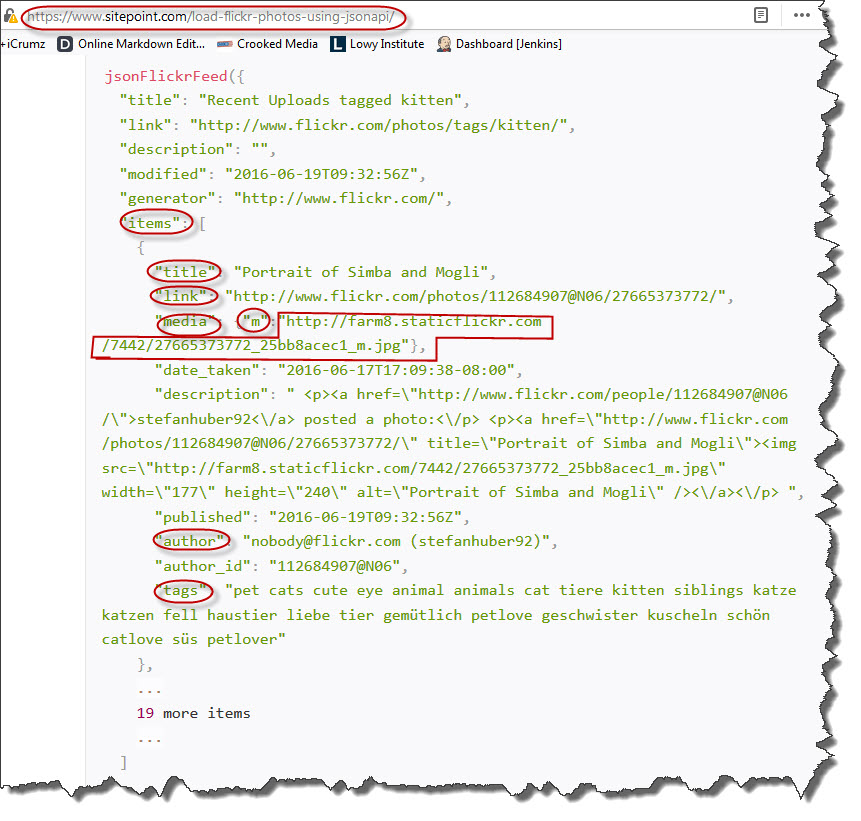

# Search Flickr with AngularJS
An Application to Search Flickr with AngularJS as user interface vuilding tool.

# Execution
Two ways to execute the application.

## Directly at Plunkr
A public Plunk URL [1] has been created for direct execution.

## Indirectly through source codes
Extract the package zip file from [2] into a working directory.
Then open index.html with a web browsers. 

## Supported web browsers
The application has been tested with following browsers with side-effect:
Google Chrome: ver 62.0.3202.94 (64-bit)
Firefox: ver 57.0 (32-bit)

# Technologies in use

## AngularJS
Angular JS ver 1.2.0 has be utilised in this application, noteworthily:
   - ng-show - makes the image detailconsitionally 
   - ng-keyup

## HTML5
Following semantic HTML5 elements have been in use:
   - article
   - section
   - figure

## CSS3 
Following properties have been used:
   - border-radius
   - box-shadow
   - transition
   - -webkit-transition
   - -moz-transition		
   - -ms-transition	
   - -o-transition	

# Technical note
## Change of Protocal HTTP to HTTPS
When the application was opened directly by web browsers, such as Firefox and Google Chrome, 
the URLs of FlickrAPI[3] and referenced AngularJS lbrary [4] has no pronblem staying with "http" 
protocal. But as the solution needs to be ported to online collaborating tool CodePen or Plunkr, 
especially the latter demands much securer "https" protocol. Hence we have to actuate such change 
onto two above mentioned URLs accordingly, resulting in [5] and [6] respectively.

## Referring to a JSON Flickr Feed
  
As screenshot illustrated above, following properties of each image object item of a received JSON Flickr feed [7] have been utilised:
   - title
   - link - points to underlying image of original size 
   - media - whose m property containing smaller size image is used to form thumbnail of images
   - author
   - tags

# ToDo
| item | Description | Implemented? (Y/N) |
| ---:|:-------------|:-----:|
|1| Make the limit of number of image objects configurable. (Currently the limit is default to 20.) | N |
|2| Move current optionally displayed "More details of selected image" area from top of page to the right of tags input area, hopefully achieving better user experience.| Y | 

# Reference
[1] https://run.plnkr.co/plunks/DOdGfl/
[2] https://github.com/SpenserKao/Search-Flickr-with-AngularJS
[3] http://api.flickr.com/services/feeds/photos_public.gne  
[4] http://code.angularjs.org/1.2.0/angular.js  
[5] https://api.flickr.com/services/feeds/photos_public.gne  
[6] https://code.angularjs.org/1.2.0/angular.js  
[7] https://www.sitepoint.com/load-flickr-photos-using-jsonapi
# ToDo
| item | Description | Implemented? (Y/N) |
| ---:|:-------------|:-----:|
|1| Make the limit of number of image objects configurable. (Currently the limit is default to 20.) | N |
|2| Move current optionally displayed "More details of selected image" area from top of page to the right of tags input area, hopefully achieving better user experience.| Y | 

# Reference
[1] http://api.flickr.com/services/feeds/photos_public.gne  
[2] http://code.angularjs.org/1.2.0/angular.js  
[3] https://api.flickr.com/services/feeds/photos_public.gne  
[4] https://code.angularjs.org/1.2.0/angular.js  
[5] https://www.sitepoint.com/load-flickr-photos-using-jsonapi/
